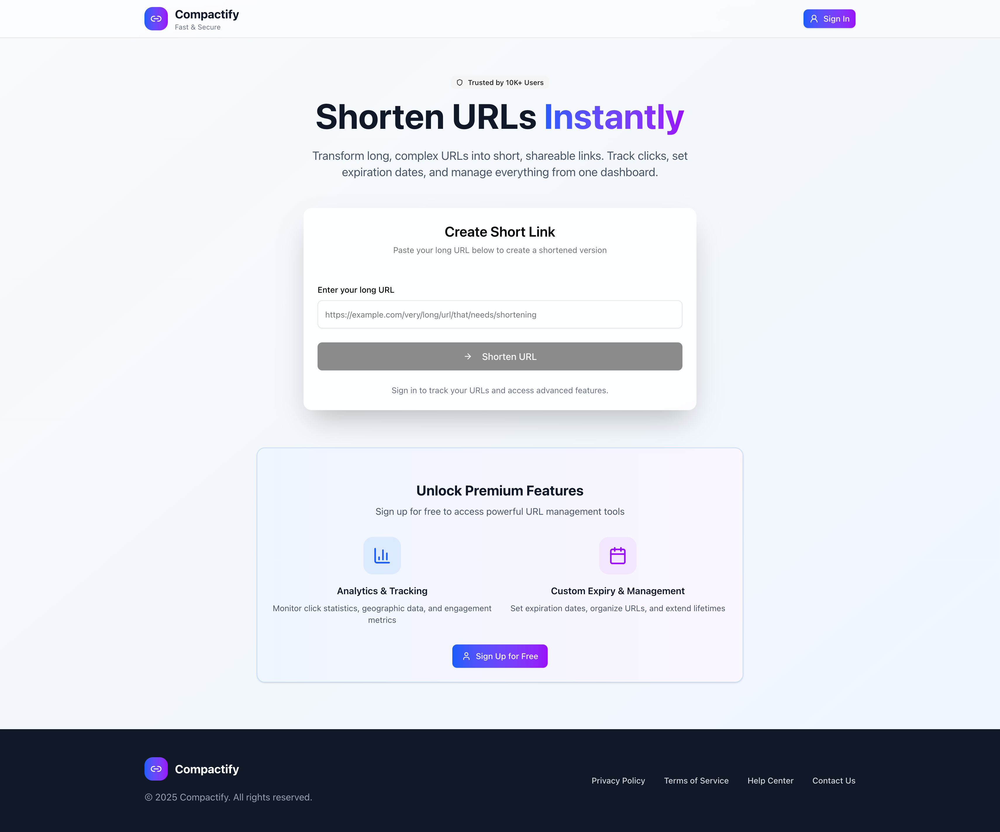
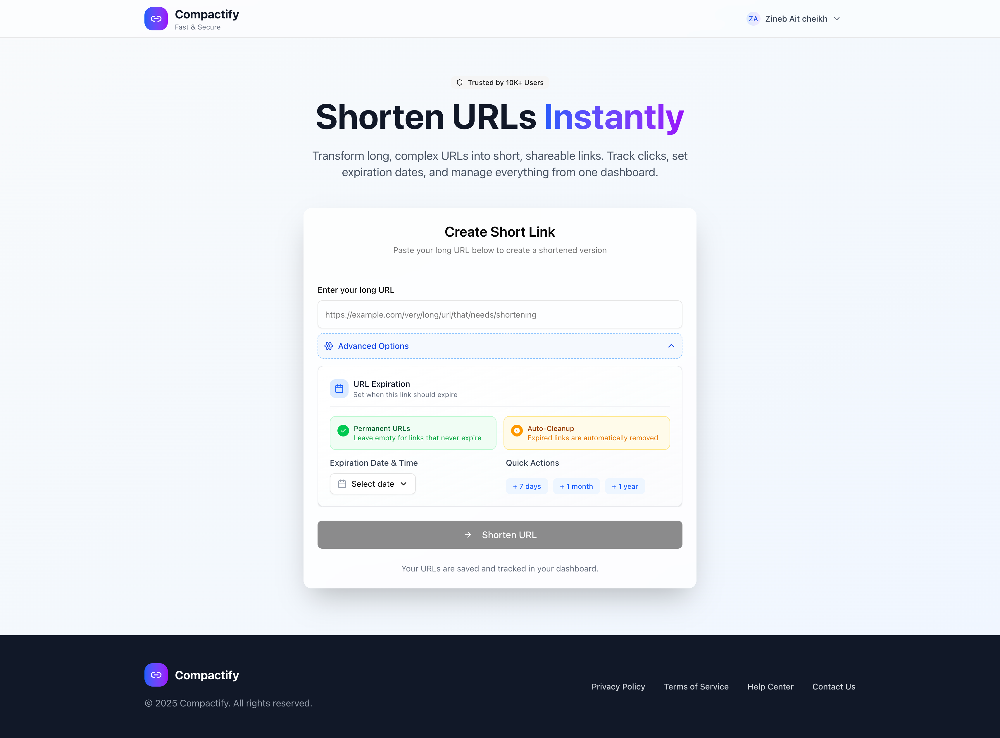
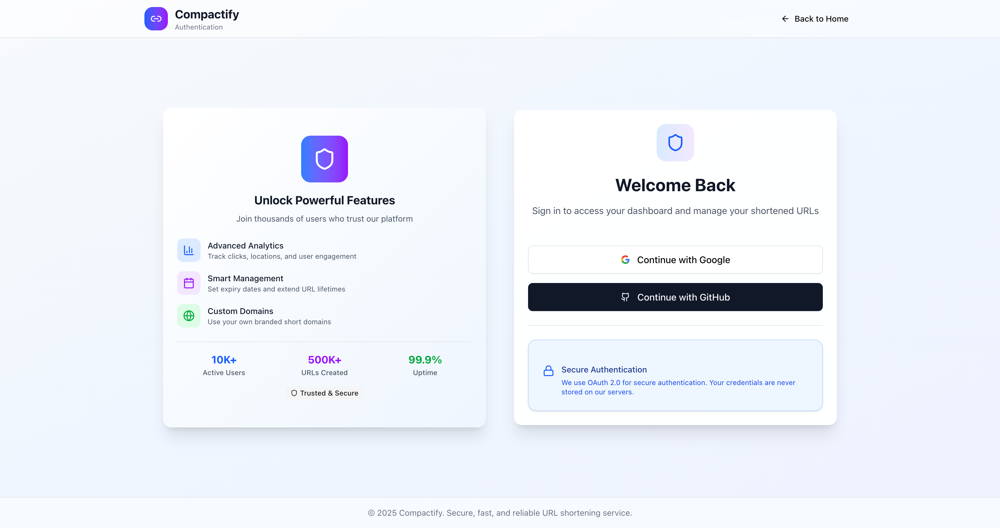
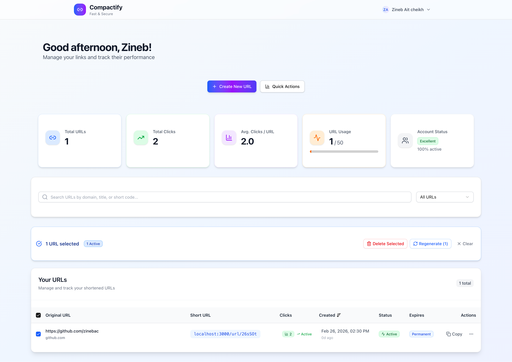
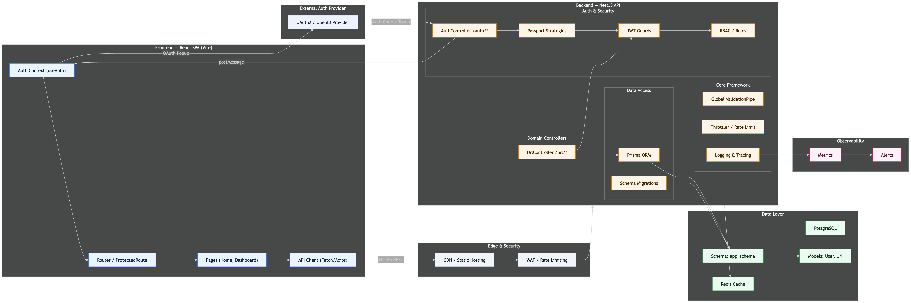

<div align="center">
  
  <h1>Compactify</h1>
  <p><strong>A full-stack URL shortener with analytics, expiration control, and OAuth authentication.</strong></p>

  <p>
    
    
    
    
    
    
  </p>

  
</div>

---

## Overview

Compactify lets users shorten long URLs, set optional expiration dates, and track click analytics — all from a clean dashboard. Anonymous users can create temporary links instantly; authenticated users get a full management interface with bulk actions, CSV export, and per-link statistics.

### Screenshots

<table>
  <tr>
    <td></td>
    <td></td>
  </tr>
  <tr>
    <td align="center"><em>Landing — instant URL shortening</em></td>
    <td align="center"><em>Advanced expiry & auto-cleanup options</em></td>
  </tr>
  <tr>
    <td></td>
    <td></td>
  </tr>
  <tr>
    <td align="center"><em>OAuth via Google or GitHub</em></td>
    <td align="center"><em>Dashboard — stats, filters, bulk actions</em></td>
  </tr>
</table>

---

## Features

| Feature | Details |
|---|---|
| **URL shortening** | Creates unique 8-character short codes with configurable length |
| **Expiration control** | Set permanent or time-limited links; auto-cleanup on expiry |
| **Click analytics** | Per-link click counter, avg clicks/URL, and dashboard metrics |
| **OAuth authentication** | Sign in with Google or GitHub via Passport.js |
| **Anonymous links** | No account needed; links expire after 7 days by default |
| **Bulk operations** | Select multiple URLs for bulk delete or short code regeneration |
| **CSV export** | Export all URLs and stats as a spreadsheet |
| **Rate limiting** | Per-endpoint throttling (dashboard: 60/min, create: 20/min, redirect: 120/min) |
| **Docker support** | One-command spin-up with `docker compose up` |

---

## Tech Stack

### Backend
- **[NestJS](https://nestjs.com/)** — modular Node.js framework
- **[Prisma](https://www.prisma.io/)** — type-safe ORM with PostgreSQL
- **[Passport.js](http://www.passportjs.org/)** — Google OAuth 2.0 & GitHub OAuth strategies
- **[JWT](https://jwt.io/)** — access + refresh token authentication
- **[@nestjs/throttler](https://docs.nestjs.com/security/rate-limiting)** — rate limiting per endpoint
- **[class-validator](https://github.com/typestack/class-validator)** — request DTO validation

### Frontend
- **[React 19](https://react.dev/)** + **[TypeScript](https://www.typescriptlang.org/)** + **[Vite](https://vitejs.dev/)**
- **[shadcn/ui](https://ui.shadcn.com/)** — accessible component library (Radix UI primitives)
- **[Tailwind CSS](https://tailwindcss.com/)** — utility-first styling
- **[Framer Motion](https://www.framer.com/motion/)** — page and element animations
- **[React Router v6](https://reactrouter.com/)** — client-side routing with protected routes

### Infrastructure
- **PostgreSQL 16** — primary database with a dedicated `app_schema`
- **[Adminer](https://www.adminer.org/)** — database management UI (Docker only)
- **Nginx** — serves the production frontend SPA with aggressive asset caching

---

## Architecture



---

## Getting Started

### Option A — Docker (recommended)

Requires [Docker Desktop](https://www.docker.com/products/docker-desktop/).

```bash
# 1. Clone the repo
git clone https://github.com/your-username/compactify.git
cd compactify

# 2. Configure environment
cp backend/.env.example backend/.env
# Fill in GOOGLE_CLIENT_ID, GOOGLE_CLIENT_SECRET,
#         GITHUB_CLIENT_ID, GITHUB_CLIENT_SECRET, JWT_SECRET

# 3. Start all services (postgres, backend, frontend, adminer)
docker compose up --build
```

| Service | URL |
|---|---|
| Frontend | http://localhost |
| Backend API | http://localhost:3000 |
| Adminer (DB UI) | http://localhost:8080 |

> **First run:** Docker will initialise the database with `init.sh`, creating `app_user` and `app_schema`. Prisma then applies the schema on backend startup.
>
> **Adminer login:** System `PostgreSQL`, Server `postgres`, Username `app_user`, Password `app_password`, Database `compactify`.

---

### Option B — Local development

**Prerequisites:** Node.js 20+, PostgreSQL 14+

```bash
# 1. Clone
git clone https://github.com/your-username/compactify.git
cd compactify

# 2. Backend
cd backend
cp .env.example .env       # fill in all values
npm install
npx prisma db push         # create tables
npm run start:dev          # http://localhost:3000

# 3. Frontend (new terminal)
cd frontend
cp .env.example .env       # set VITE_API_URL=http://localhost:3000
npm install
npm run dev                # http://localhost:5173
```

---

## Environment Variables

### `backend/.env`

| Variable | Description |
|---|---|
| `DATABASE_URL` | Prisma connection string (include `?schema=app_schema`) |
| `JWT_SECRET` | Long random secret for signing tokens (`openssl rand -hex 64`) |
| `GOOGLE_CLIENT_ID` / `GOOGLE_CLIENT_SECRET` | From [Google Cloud Console](https://console.cloud.google.com/) |
| `GITHUB_CLIENT_ID` / `GITHUB_CLIENT_SECRET` | From [GitHub Developer Settings](https://github.com/settings/developers) |
| `GOOGLE_CALLBACK_URL` / `GITHUB_CALLBACK_URL` | Must match the redirect URI registered with the provider |
| `FRONTEND_URL` | Used for CORS origin allow-list |
| `URL_MAX_PER_USER` | Max URLs a single user can create (default `50`) |
| `URL_ANONYMOUS_EXPIRY_LENGTH` | Days before anonymous links expire (default `7`) |

### `frontend/.env`

| Variable | Description |
|---|---|
| `VITE_API_URL` | Public-facing backend URL — baked into the Vite bundle at build time |

---

## Project Structure

```
compactify/
├── backend/
│   ├── src/
│   │   ├── auth/           # Passport strategies, JWT, OAuth callbacks
│   │   ├── url/            # URL CRUD, redirect, dashboard, DTOs
│   │   ├── prisma/         # PrismaService wrapper
│   │   └── app.module.ts
│   ├── prisma/
│   │   └── schema.prisma   # User + Url models
│   ├── test/               # e2e specs
│   └── Dockerfile
├── frontend/
│   ├── src/
│   │   ├── components/     # UI components (shadcn + custom)
│   │   ├── pages/          # Home, Dashboard, Auth, AuthCallback
│   │   ├── hooks/          # useUrl
│   │   ├── services/       # api.ts, auth.ts, token.ts
│   │   ├── utils/          # dateUtils, popup-auth
│   │   └── types/          # Shared TypeScript interfaces
│   └── Dockerfile
├── assets/                 # Screenshots
├── init.sh                 # PostgreSQL bootstrap script
└── docker-compose.yml
```

---

## Contributing

Contributions, issues, and feature requests are welcome.

1. Fork the repository
2. Create a feature branch (`git checkout -b feat/my-feature`)
3. Commit your changes (`git commit -m 'feat: add my feature'`)
4. Push to the branch (`git push origin feat/my-feature`)
5. Open a Pull Request

---

## License

MIT © [ZAC](https://github.com/zinebac)
